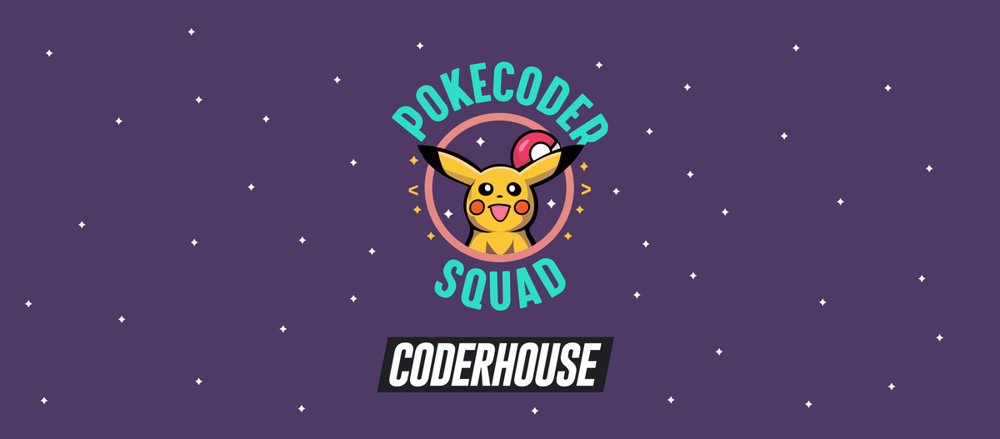

# PROJETO GRUPO 05 - POKÉMON

#### Equipe

-   [Luiza Pereira Moreira](https://github.com/lulululluiza)
-   [Elias Corrêa](https://github.com/eliascorreajr)
-   [Raul Lima](https://github.com/raul-lima)
-   [Jonathan Maia](https://github.com/jonathanppmaia)
-   Pedro Souza
-   Agda Jeronimo

#### Deploy do Projeto

-   [Projeto Pokemon Coderhouse](https://lulululluiza.github.io/projeto-devweb-grupo5/)

#### Informações sobre o projeto:

Projeto final para o curso de programação web da Coderhouse com o objetivo de desenvolver um site com 5 seções, em diferentes arquivos HTML. Ele terá conteúdo, imagens, hyperlinks, estrutura, controle de grids, uso do framework, SEO e animação.

-   Tema: Pokemon

#### Objetivo:

Desenvolver uma página principal envolvente e interativa para fãs de Pokémon, proporcionando uma experiência única e oferecendo conteúdo relevante e atualizado.

#### Elementos essenciais da página:

##### Cabeçalho:

-   Logo da página (pode ser uma combinação criativa de um Pokémon popular e o nome da página).
-   Barra de navegação com links para outras seções ou páginas (ex: Pokedex, Artigos, Galeria, Fórum, etc.).
-   Banner Principal:
-   Imagem rotativa de Pokémon destacados ou eventos atuais.
-   Botão de call-to-action (CTA) para novidades ou eventos especiais.

##### Seção de Notícias:

-   Atualizações recentes sobre o mundo Pokémon: lançamentos de jogos, atualizações de séries, eventos, etc (API do Twitter para mostrar notícias recentes da página do Pokémon)
-   Cada notícia com uma imagem, título e breve descrição. Ao clicar, leva ao artigo completo.
-   Pokedex Interativa: Uma mini Pokedex onde os usuários podem buscar rapidamente por um Pokémon e obter informações básicas.
-   Opção de ir para uma Pokedex mais completa em outra página.

##### Galeria de Fãs:

-   Espaço para os fãs enviarem suas artes, desenhos ou fotos relacionadas a Pokémon.
-   Uma seleção rotativa das melhores contribuições.
-   Fórum/Comunidade:
-   Breve visão geral dos tópicos mais recentes ou populares.
-   Botão para acessar o fórum completo.

##### Rodapé:

-   Links para políticas do site, contato, redes sociais e outros links relevantes.
-   Créditos e direitos autorais.

#### Link com o design do projeto no Figma:

https://www.figma.com/file/5m7qgUq5mvZyoqvuRzvxOH/Pok%C3%A9mon---Coderhouse-Equipe-05?type=design&mode=design&t=JCD7DPOLxtQ37t4J-1

#### Tecnológias utilizadas

   
  
    
   

